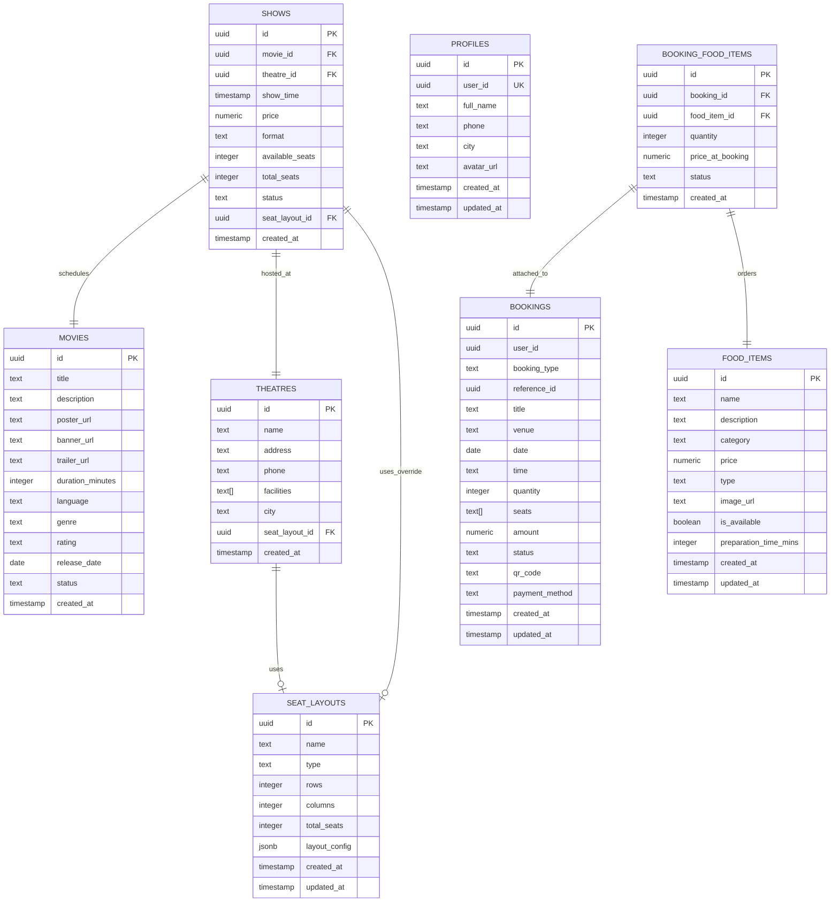

# GrabAticket - Schema & API Documentation

This document describes the database schema, entity relationships, and client API functions designed for the fresh ticketing and food ordering application.

---

## 1. Entity-Relationship Diagram (ERD)

The database schema is decoupled from direct dependencies on Supabase Auth tables to ensure portability across different host environments. Users are linked using their provider UID (`user_id`).



---

## 2. Table Definitions

### `seat_layouts`

Stores configurations representing screen seats (VIP, IMAX, or bus seats).

- `id` (UUID, PK): Auto-generated unique identifier.
- `name` (TEXT, Not Null): Label representing this layout.
- `type` (TEXT, Default 'theatre'): Layout classification (e.g., 'theatre', 'bus').
- `rows`/`columns` (INTEGER): Grid dimensions.
- `total_seats` (INTEGER): Count of active seats.
- `layout_config` (JSONB): Dynamic seating grid metadata (row name, seat types, multipliers).

### `movies`

Contains active lists of movies, descriptions, durations, and trailers.

- `status` (TEXT): Constrained to `now_showing`, `coming_soon`, or `ended`.

### `theatres`

Venues hosting movie shows.

- `city` (TEXT): Clean text field specifying region/city (decoupled for portability).
- `seat_layout_id` (UUID, FK): References default seating structure.

### `shows`

Individual scheduled show timings.

- `movie_id` / `theatre_id` (UUID, FK, Cascade): Links the movie and location.
- `price` (NUMERIC(10,2)): Base ticket pricing.
- `available_seats` / `total_seats` (INTEGER): Active seat counters.

### `profiles`

User profiles containing names, preferences, and avatars.

- `user_id` (UUID, Unique): Links back to the user auth provider.

### `bookings`

Core tickets or food order transactions.

- `booking_type` (TEXT): Constrained to `movie`, `food_only`, or `other`.
- `status` (TEXT): Checked constraints for `pending`, `confirmed`, `completed`, or `cancelled`.

### `food_items`

Cafeteria menus including details, prices, classifications, and preparation times.

- `type` (TEXT): Categorizations including `Veg`, `Non-Veg`, `Egg`, or `Vegan`.

### `booking_food_items`

Junction connecting ordered foods to general bookings.

- `status` (TEXT): Culinary preparation status tracking: `Pending`, `Preparing`, `Ready`, `Delivered`.

---

## 3. Database Migration & Setup

To deploy the schema and seed data in your project, follow these steps:

1. **Deploy Schema**: Run the schema creation queries:

   ```bash
   psql -h <host> -U <user> -d <dbname> -f supabase/fresh_schema/schema.sql
   ```

2. **Seed Sample Data**: Run the seed script:

   ```bash
   psql -h <host> -U <user> -d <dbname> -f supabase/fresh_schema/seed.sql
   ```

Or if utilizing Supabase CLI:

```bash
supabase migration new fresh_schema
# Copy contents from supabase/migrations/20260609000000_fresh_schema.sql into the newly generated file.
supabase db push
```

---

## 4. API Library Integration Examples

Here are TypeScript examples utilizing the API routines located in [fresh_db.ts](file:///c:/Users/hp/Desktop/GrabAticket-main/src/lib/fresh_db.ts):

### Fetching Movie Catalogs

```typescript
import { getMovies } from './lib/fresh_db';

// Fetch movies that are currently showing
const activeMovies = await getMovies('now_showing');
console.log('Now Showing:', activeMovies);
```

### Pre-ordering Food & Movie Tickets (Unified Transaction)

```typescript
import { createBooking } from './lib/fresh_db';

const newReservation = await createBooking({
  userId: 'user-uuid-from-auth-context',
  bookingType: 'movie',
  referenceId: 'show-uuid-here',
  title: 'Pushpa 2: The Rule',
  venue: 'AMB Cinemas: Gachibowli',
  date: '2026-06-10',
  time: '18:30',
  quantity: 2,
  seats: ['A1', 'A2'],
  amount: 1230.00, // Total ticket cost + food items
  paymentMethod: 'UPI',
  foodItems: [
    {
      foodItemId: 'popcorn-item-uuid',
      quantity: 1,
      priceAtBooking: 280.00
    },
    {
      foodItemId: 'coke-item-uuid',
      quantity: 2,
      priceAtBooking: 150.00
    }
  ]
});

console.log('Booking successful:', newReservation.id);
```
